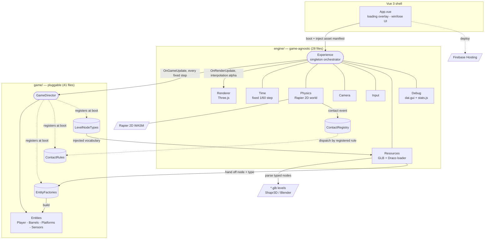
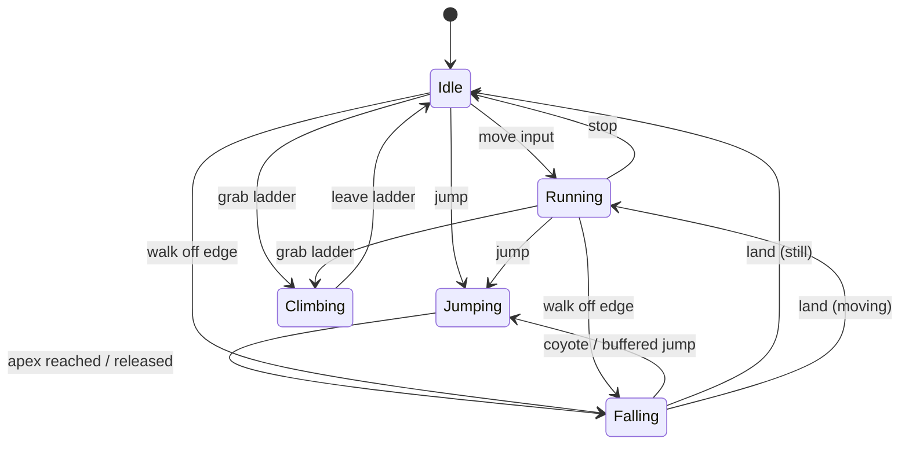
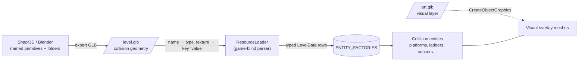

# FireGame

_A small, portable 2D game engine — Rapier physics + Three.js, ~760 KB gzipped, zero backend. Ships as a from-scratch Donkey Kong 1981 tribute._

<!-- Languages -->


<!-- Frameworks & build -->


<!-- Graphics & physics -->


<!-- Libraries & tooling -->


<!-- Footprint & infra -->


FireGame is a small, portable 2D game engine with 3D renderer. The whole thing — a WebGL renderer, a Rust-built physics engine, a reactive UI shell, and all the game code — compiles to one ~760 KB gzipped JavaScript chunk, with four runtime dependencies and zero backend: the URL _is_ the game, and it can run anywhere a browser runs. The engine names zero game concepts — physics, rendering, GLB level loading, and collision dispatch all sit behind seams the game plugs into through registries and factories, so the dependency arrows only ever point `game → engine`.

The Donkey Kong platformer on top is both an homage and the baseline I used to prove the core could carry a real game with hard-won feel.

[Play it live](https://firegamedk.web.app) · [Architecture](#architecture) · [What I Learned](#what-i-learned)

---


<!-- TODO: replace with a real demo.gif (≤1200px wide). Best single moment to capture: the player jumping a rolling barrel mid-stride on the Donkey Kong level, with a second barrel chasing. Use Kap (Mac) / ScreenToGif (Windows) / LICEcap. -->

## Why this exists

I love video games, and the surest way I know to understand something is to build the machine underneath it. I could have reached for Unity and saved myself countless hours and my sanity, but building from scratch taught me what Unity, Unreal, and Source actually do and how they work — and gave me the lightweight, portable, deterministic version I always wanted. Now I know exactly where to reach: post-processing, the multiplayer roadmap, splitting level design from art so I can build levels with friends.

It started narrower — a testbed where I could plug in anywhere and turn stable-baselines loose to teach an algorithm to play Donkey Kong, or anything I built. Then I fell in love with making the engine generic and good, and refactoring became the fun. So now it's mine: a fully capable Billy-made game engine, not a one-off for teaching AI how to play.

## Features

- **Tiny & portable — the URL is the game.** ~760 KB gzipped in one JS chunk (Rapier's WASM base64-inlined) plus a small lazy-loaded Draco decoder. Four runtime dependencies, zero native dependencies, zero backend. The same binary runs on any modern browser with WebGL2 — desktop, phone, tablet, kiosk — no app store, no porting.
- **Two-layer level pipeline (gameplay vs. visual).** Collision/gameplay geometry lives in one lean GLB; a detailed art layer is a _separate_ GLB merged at runtime — so feel is tuned against bare collision shapes and the art can be swapped or detailed without ever touching physics. The parser is game-blind: an entity's type comes from a node's name, its per-instance data from **texture-name `key=value` tags**, both supplied by the game.
- **Jitter-free kinematic character controller.** Built on Rapier's `KinematicCharacterController`, driven by five shapecasts per frame (four directions plus a snap-to-ground probe) rather than translate-and-resolve. No floor-clipping, no wall-sticking, clean slopes and steps.
- **Deterministic core with interpolated rendering — netcode-ready.** A fixed `1/60 s` timestep (≤5 catch-up steps/frame) plus a seeded `mulberry32` PRNG (seed `1337`, re-seeded on reset) make identical inputs produce bit-identical physics on any refresh rate, and every run replays the exact barrel sequence. Rendering lerps between sim states (`OnRenderUpdate(alpha)`), so it's smooth at 144 Hz with no judder below the sim rate.
- **One generic FSM + data-driven entities.** A single generic `StateMachine<H, S>` — whose `Update()` is one line — powers the player (idle/run/jump/fall/climb) and all three barrel AIs (roll/descend/bounce), which differ only by their starting state. Adding a placeable thing is a factory entry + a type string + an optional contact rule; no `instanceof`, no director surgery.
- **Declarative collision dispatch.** Physics resolves a contact to two `GameObject`s and fires it into a game-owned rule table — there is no entity-type `if`/`switch` anywhere in the physics code. Two producers (Rapier's event queue and the player's kinematic controller) feed the same table, so a hit registers whichever body moved.
- **Real platformer "feel," externalized as data.** Coyote time, jump buffering, variable height, apex hang, and asymmetric rise/fall gravity are all tunable constants in named profiles. Swap the whole game's feel by swapping one profile (`dk` ↔ `celeste`, same controller, ~2× faster).
- **Live tuning + `#debug` overlay (ships in prod).** Append `#debug` to any build for physics wireframes, shapecast visualizers, an FPS graph, and dat.GUI sliders bound to live feel/enemy knobs — and a `dumpFeelValues()` that prints a ready-to-paste attributes block, closing the loop from "tweak by hand" to "commit the numbers."

<!-- TODO: optional second screenshot near here — the #debug overlay showing physics capsule wireframes + the shapecast rays under the player, plus the dat.gui panel. -->

## Tech stack

**Language & build**

- **TypeScript 5** — strict, end to end across the engine and game layers.
- **Vite 8** — dev server, HMR, and the production bundler. Levels are auto-discovered with `import.meta.glob` and content-hashed.
- **Vue 3** — a thin presentation shell that owns only the loading overlay and UI. It boots the engine and stays out of the game loop.

**Rendering & physics**

- **Three.js (r162)** — WebGL rendering, scene graph, GLTF/GLB loading, sprite-sheet animation.
- **Rapier 2D (`@dimforge/rapier2d-compat` 0.14)** — WASM rigid-body physics; the kinematic character controller, shapecasts, sensors, and the contact event queue all come from here. Chosen specifically because it's determinism-capable.

**Libraries & tooling**

- **Draco** — GLB geometry decompression (decoder shipped in `public/draco/`), so level meshes load small.
- **mitt** — the tiny typed event bus the engine and game communicate over (loading, win/lose, level switch).
- **dat.GUI** — runtime tuning sliders for feel and enemy behavior.
- **stats.js** — the FPS / frame-time graph in debug builds.

**Infrastructure**

- **Firebase Hosting** — static deploy target (`dist/`), long-cache headers on hashed assets, no-cache on the shell. _Hosting-only, the app pulls in no Firebase SDK and needs no env vars to run._

## Architecture



The interesting node is **`ContactRegistry`**. When Rapier reports two colliders touched, the physics layer does exactly one game-aware thing — resolve each collider back to its owning `GameObject` — then dispatches the pair into a table the game filled at startup (`"when a Player touches an Enemy, run this handler"`). There's no entity-type branching in the physics code at all; the engine doesn't know what a "barrel" or a "ladder" is. That single indirection is what lets `engine/` import nothing from `game/`, and it's the same shape used for the camera (which reads a five-scalar `CameraTarget`, not a `Player`) and the debug palette (an injected `type → color` map). It's the seam that would let this physics core drive a completely different game.

<!-- Optional: replace the Mermaid diagram with a custom image (Excalidraw, draw.io, Figma export) for a more polished look -->
<!--  -->

### DK Player state machine



Each state is its own handler file, and the barrel AIs run on the same generic `StateMachine` class. Coyote time and jump buffering both live in the `Falling` handler — a buffered jump fires when the player presses jump within range of the ground, and a coyote jump fires within a 0.05s grace window after leaving an edge.

## The two-layer level pipeline

Levels are brought in as two separate concerns, two separate files.

1. **The gameplay level** is a lean GLB of pure collision geometry — the Donkey Kong level is ~200 KB. Every node is an untextured primitive (cube / sphere / capsule) whose name is its type channel and whose texture name carries a `key=value` metadata bag.
2. **The visual layer** is a completely separate art GLB, layered on at runtime (`GraphicsObject.CreateObjectGraphics()` clones its meshes so each entity owns its own GPU buffers). Nodes marked `GraphicsObject` are parsed but carry no physics.

Gameplay feel is authored against collision shapes alone, the art can be as heavy and detailed as you like without adding a gram to the physics world. The same mechanism drives every entity's mesh (the player sprite, the barrels).

The parser that reads all this names nothing about the game. It reads a node's name (first token, lowercased) and looks it up in a `LEVEL_NODE_TYPES` map the game injected at boot, it reads `key=value` tags off the texture name into an uninterpreted string bag that each factory pulls only its own keys from. So the engine never learns what a "platform" is — only that a named cube exists at a transform with some string metadata.



Authoring is folder-organized for sanity — `Platforms/`, `OneWayPlatforms/`, `Walls/`, `Ladders/{Top,Core,Bottom}/`, `Sensors/Cameras/`, `Entities/`, `Graphics/` — but that hierarchy is pure editor UX. Shapr3D and Blender flatten folders on export, so the runtime contract is the node name, which survives editor de-duplication (`Platform_1` and `Platform` both resolve to `platform`). Adding a new level is: model it, export the GLB into `src/assets/levels/` (Vite auto-discovers it), add one registry row. Adding a new kind of object is a factory entry plus a name→type row — no loader edits. The `devAssets/` folder holds the Blender export scripts and a longer format reference (`GLB_LEVEL_FORMAT.md`).

Three levels ship today: _Slopes Testing_, _Camera Testing_, _Platform Testing_, and a _Donkey Kong 1981_ recreation. They currently render their collision geometry directly; the detailed-art overlay slot (`graphics:` in the level registry) is wired only to the Donkey Kong stage.

## Determinism & the road to multiplayer

Determinism here is a foundation, not a feel afterthought — it's why I reached for Rapier (a Rust-built, WASM, determinism-capable solver) in the first place.

- **Fixed-timestep accumulator.** The sim advances in constant `1/60 s` steps regardless of frame rate, frame delta is clamped to `1/30`, and at most 5 catch-up steps run per frame (no spiral of death). Identical inputs on a 60 Hz and a 144 Hz display produce bit-identical physics.
- **Seeded PRNG.** Every gameplay draw — the spawn cadence, the barrels' ladder-take dice — comes from a seeded `mulberry32` generator (32-bit integer math, seed `1337`), never `Math.random()`. Reset re-seeds, so a run replays the exact same barrel sequence.
- **Interpolated rendering.** `OnRenderUpdate(alpha)` lerps meshes between their last two sim states (shortest-arc rotation, teleport snap); the camera follows the _interpolated_ position, not the stepped one — smooth above the sim rate, no judder below.
- **Input as data.** Entities read an `InputState` snapshot filled through an `InputSource` interface, not the keyboard directly. A keyboard, a network packet, a replay, or an AI are interchangeable sources — a fill-the-struct-differently problem, not a rewrite.

A deterministic sim, a seeded RNG, and input-as-data are exactly the pieces client-side prediction, server reconciliation, and rollback are built on. That groundwork is _in_.

**Roadmap (designed, not built):** multiplayer via **Colyseus** — server-authoritative, with client-side prediction, interpolation, and rollback. The remaining prerequisites are the ones the engine's own assessment names: promote the single hard-coded `Player` to an array; make `Experience` injectable rather than a (resettable) singleton so a headless server tick can run a world; and add a scene snapshot (`toSnapshot()`/`fromSnapshot()`) for save/load and rollback. Nothing about prediction or rollback exists yet — this is where it's going, not what it does.

## Platformer feel profiles & tuning

"Feel" is the part of a platformer that can't be specced — it has to be dialed in. So I pulled every feel parameter out of the player code into named profiles. Each extends a shared base (collider sizing, slope limits, coyote time, climb speeds) and overrides the jump arc on top. The two below describe completely different games from the same controller:

| Parameter               |      `dk` (Donkey Kong) | `celeste` (snappy) |
| ----------------------- | ----------------------: | -----------------: |
| Max ground speed        |                    11.8 |                 25 |
| Ground deceleration     | 100 (near-instant stop) |                 30 |
| Jump power              |                    25.2 |                128 |
| Rise gravity            |                      79 |                360 |
| Fall acceleration       |       112 (≈1.42× rise) |                440 |
| Apex-hang threshold     |                     2.5 |                 20 |
| Early-release gravity × |                     3.5 |                  3 |
| Buffer-jump range       |                     1.5 |                  4 |

The DK profile aims for a planted, weighty feel: a snappy rise, a brief apex hang, and a heavier fall (fall gravity ≈1.42× the rise) so a jump commits. Celeste is the same machinery wound up ~2× faster — same apex height, half the airtime. The recipe that made that reliable: tune the arc in slow motion until it feels right, then time-scale it (velocities ×2, accelerations ×4, times ×0.5) to preserve apex height while halving airtime. Levels pick a profile by name (`feelProfile: "dk"`), and in a `#debug` build the dat.GUI panel binds sliders straight to these knobs — tune the arc while the game runs, then `dumpFeelValues()` prints the block to paste back.

## Getting started

**Prerequisites**

- **Node 20.19+** (Vite 8 requirement) and npm.
- A WebGL2-capable browser.
- _Optional, for deploy only:_ the `firebase-tools` CLI.

**Install & run**

```bash
# 1. Install dependencies
npm install

# 2. Start the Vite dev server (no env vars required)
npm run dev
#   ➜  Local:   http://localhost:5173/
#   Append #debug to the URL for physics wireframes + tuning sliders.

# 3. Type-check + build the production bundle into dist/
npm run build

# 4. Preview the production build locally
npm run preview
```

There's nothing to configure to run locally — the game needs no API keys. The `.env` file is gitignored and holds Firebase Hosting credentials used only at deploy time (`firebase deploy`), not by the app itself.

## What I learned

- **Beating jitter meant planning against the next frame's shape, not this one.** The controller shrinks the player's capsule in the air to clear obstacles and regrows it on landing — but if it regrew into a floor, Rapier would eject the player and you'd get a one-frame pop. The fix was to fire the ground shapecast before moving and only regrow the collider once the probe proves there's free air for it, so the controller always commits the exact shape the physics step is about to apply. That ordering, not any single API call, is what made the movement feel solid.

- **Decoupling is enforced by a data structure, not by discipline.** I tried keeping physics and game separate by convention, and it eroded every time I added an enemy. Replacing collision routing with a declarative contact table — physics dispatches `(A, B, event)`, the game owns the handlers — was the change that held the line. Once there was literally no place in the physics layer to write an entity-type check, the coupling couldn't creep back. `grep -r "game/" src/engine/` still returns nothing.

- **Separating the level from the art was the unlock for both feel and size.** Authoring gameplay on bare collision geometry and layering a heavy visual GLB on top at runtime meant I could tune physics against a 200 KB level and detail the art independently. Collision stays tiny and cache-friendly, and the parser never learns what a "platform" looks like — only that a named cube exists at a transform.

- **Determinism is a decision you make early or not at all.** Swapping `Math.random()` for a seeded PRNG and re-seeding on reset was a tiny change that turned playtesting into something repeatable — the same seed gives the identical barrel sequence every run. It's also the one prerequisite you can't retrofit: a fixed timestep, a seeded RNG, and input-as-data are exactly what rollback/server-authoritative netcode needs, and an unseeded engine would desync any lockstep peer on the first dice roll.

- **Game "feel" is data, and treating it that way changes how you iterate.** A great level is built around the player and the feel of the game. Hard-coding jump constants meant every tweak was a rebuild. Lifting them into live-bound profiles collapsed the tuning loop to seconds — and split "is the physics correct?" from "does the jump feel good?" into two questions I could answer separately.
